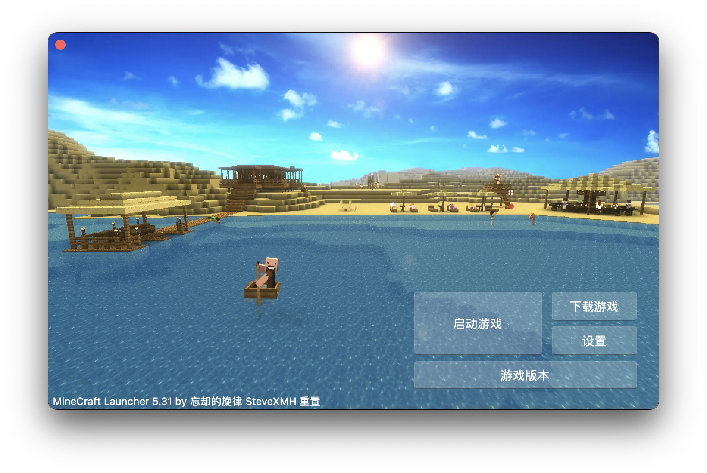
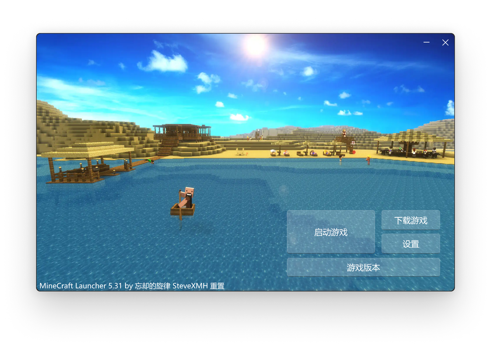

# SCL 旋律启动器 DEMO

2023 年愚人节作品，用于**简单**展示 SCL 启动器核心的使用和 SCL 组件库的使用，同时也是为了纪念这个旋律启动器。

谨以此物，纪念我的童年。

## 用法

只是纯粹地以离线用户启动当前文件夹下的 `.minecraft/versions/1.19.4` 而已，其他功能没有制作。
（可能也不会考虑制作了，毕竟只是愚人节作品）。

当然，如果有人希望还愿的话，发点 Pull Request 也不是不可以，欢迎大家来改进这个玩意哦。

## 开发

将 SCL 启动器模块仓库克隆到和本仓库文件夹同级的文件夹下，然后安装好 Rust 开发套件，执行 `cargo run` 即可。
